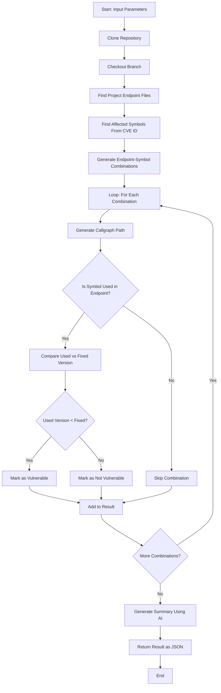

Provide the **repository**, **branch**, and **CVE ID** to identify potential vulnerabilities in the code
## Demo 1

<a href="https://youtu.be/Fs63_dcjkU8" target="_blank">
  
</a>

## Demo 2
[](https://asciinema.org/a/721319)
## Prerequisites
* Gemini API credentials
  - Create a file named `~/.gemini.conf`
  - Use the below contents (Use your API key)
    ```bash
    API_URL=https://generativelanguage.googleapis.com/v1beta/models/gemini-2.0-flash:generateContent
    API_KEY=<your-api-key>
    ```
* Podman
## Flowchart

## Usage
### Build and run as a container image
```bash
$ git clone https://github.com/k37y/gvs && cd gvs
$ make image-run
```
### Sample API request and response of govulncheck path
```bash
$ curl --request POST \
       --header "Content-Type: application/json" \
       --data '{"repo": "https://github.com/openshift/metallb", "branch": "release-4.18", "cve": "CVE-2024-45338"}' \
       http://localhost:8082/scan | jq .
```
```bash
[
  {
    "directory": "metallb/e2etest",
    "results": [
      {
        "message": "Your code imports 1 vulnerable package (golang.org/x/net/html), but doesn’t appear to call any of the vulnerable symbols.",
        "ruleId": "GO-2024-3333"
      },
      {
        "message": "Your code calls vulnerable functions in 1 package (github.com/golang/glog).",
        "ruleId": "GO-2025-3372"
      },
      {
        "message": "Your code depends on 1 vulnerable module (golang.org/x/oauth2), but doesn't appear to call any of the vulnerable symbols.",
        "ruleId": "GO-2025-3488"
      },
      {
        "message": "Your code imports 1 vulnerable package (golang.org/x/net/proxy), but doesn’t appear to call any of the vulnerable symbols.",
        "ruleId": "GO-2025-3503"
      },
      {
        "message": "Your code calls vulnerable functions in 1 package (net/http/internal).",
        "ruleId": "GO-2025-3563"
      },
      {
        "message": "Your code imports 1 vulnerable package (golang.org/x/net/html), but doesn’t appear to call any of the vulnerable symbols.",
        "ruleId": "GO-2025-3595"
      }
    ]
  },
  {
    "directory": "metallb",
    "results": [
      {
        "message": "Your code depends on 1 vulnerable module (golang.org/x/net), but doesn't appear to call any of the vulnerable symbols.",
        "ruleId": "GO-2024-3333"
      },
      {
        "message": "Your code depends on 1 vulnerable module (golang.org/x/oauth2), but doesn't appear to call any of the vulnerable symbols.",
        "ruleId": "GO-2025-3488"
      },
      {
        "message": "Your code depends on 1 vulnerable module (golang.org/x/net), but doesn't appear to call any of the vulnerable symbols.",
        "ruleId": "GO-2025-3503"
      },
      {
        "message": "Your code calls vulnerable functions in 1 package (net/http/internal).",
        "ruleId": "GO-2025-3563"
      },
      {
        "message": "Your code depends on 1 vulnerable module (golang.org/x/net), but doesn't appear to call any of the vulnerable symbols.",
        "ruleId": "GO-2025-3595"
      }
    ]
  },
  {
    "directory": "metallb/website/themes/hugo-theme-relearn",
    "results": null
  }
]
```
### Sample API request and response of callgraph path
```bash
$ curl --request POST \
       --header "Content-Type: application/json" \
       --data '{"repo": "https://github.com/openshift/metallb", "branch": "release-4.18", "cve": "CVE-2024-45338"}' \
       http://10.0.0.10:8082/callgraph | jq .
```
```bash
{
  "taskId": "1748493013100462517"
}
```
```bash
$ curl --silent \
       --request POST \
       --header "Content-Type: application/json" \
       --data '{"taskId":"1748493013100462517"}' \
       http://localhost:8082/status | jq .output
```
```bash
{
  "AffectedImports": {
    "golang.org/x/net/html": {
      "FixedVersion": [
        "v0.33.0"
      ],
      "Symbols": [
        "Parse",
        "ParseFragment",
        "ParseFragmentWithOptions",
        "ParseWithOptions",
        "htmlIntegrationPoint",
        "inBodyIM",
        "inTableIM",
        "parseDoctype"
      ],
      "Type": "non-stdlib"
    }
  },
  "Branch": "release-4.18",
  "CVE": "CVE-2024-45338",
  "Directory": "/tmp/cg-metallb-1402140135",
  "Errors": null,
  "Files": {
    ".": [
      [
        "configmaptocrs/main.go",
        "configmaptocrs/types.go"
      ],
      [
        "controller/main.go",
        "controller/service.go"
      ],
      [
        "frr-tools/cp-tool/cp-tool.go"
      ],
      [
        "frr-tools/metrics/exporter.go"
      ],
      [
        "speaker/bgp_controller.go",
        "speaker/layer2_controller.go",
        "speaker/main.go"
      ]
    ],
    "e2etest": null,
    "website/themes/hugo-theme-relearn": null
  },
  "GoCVE": "GO-2024-3333",
  "IsVulnerable": "false",
  "Repository": "https://github.com/openshift/metallb",
  "Summary": "**Vulnerability Assessment Summary**\n\nNo vulnerability was detected in the scanned project (Repository: `https://github.com/openshift/metallb`, Branch: `release-4.18`, Directory: ``, GoCVE: `GO-2024-3333`, CVE: `CVE-2024-45338`). No errors were encountered during the scan.\n",
  "UsedImports": null
}
```
