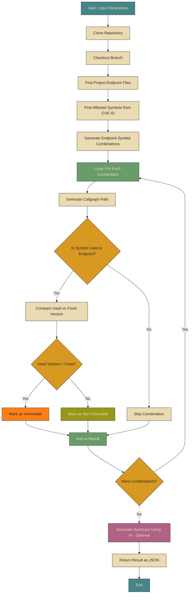

Find vulnerability status from **Git repository URL**, **Git branch name**, and **CVE ID**
## Demo 1
[!demo-1](https://github.com/user-attachments/assets/3b013256-368f-45b1-8cd3-897173a48814)
## Demo 2
[](https://asciinema.org/a/721319)
## Flowchart

## Prerequisites
* `podman`, `git`, `jq` and `make`
* Gemini API credentials (optional)

  If Gemini credentials are absent, the `Summary` field in the final JSON result will be an error message.
  - Create a file named `~/.gemini.conf`
  - Use the below contents
    ```bash
    API_URL=https://generativelanguage.googleapis.com/v1beta/models/gemini-2.0-flash:generateContent
    API_KEY=<your-api-key>
    ```
## Usage
### Build and run as a container image
```bash
$ git clone https://github.com/k37y/gvs && cd gvs
$ make image-run
```
### Sample API request and response of callgraph path
```bash
$ curl --request POST \
       --header "Content-Type: application/json" \
       --data '{"repo": "https://github.com/k37y/gvs-example-one", "branch": "main", "cve": "CVE-2024-45338"}' \
       http://localhost:8082/callgraph | jq .
```
```bash
{
  "taskId": "1748493013100462517"
}
```
```bash
$ curl --silent \
       --request POST \
       --header "Content-Type: application/json" \
       --data '{"taskId":"1748493013100462517"}' \
       http://localhost:8082/status | jq .output
```
```bash
{
  "AffectedImports": {
    "golang.org/x/net/html": {
      "FixedVersion": [
        "v0.33.0"
      ],
      "Symbols": [
        "Parse",
        "ParseFragment",
        "ParseFragmentWithOptions",
        "ParseWithOptions",
        "htmlIntegrationPoint",
        "inBodyIM",
        "inTableIM",
        "parseDoctype"
      ],
      "Type": "non-stdlib"
    }
  },
  "Branch": "main",
  "CVE": "CVE-2024-45338",
  "Directory": "/tmp/cg-gvs-example-one-2212737432",
  "Errors": null,
  "Files": {
    ".": [
      [
        "main.go"
      ]
    ]
  },
  "GoCVE": "GO-2024-3333",
  "IsVulnerable": "true",
  "Repository": "https://github.com/k37y/gvs-example-one",
  "Summary": "## Vulnerability Report Summary

The project is vulnerable to CVE-2024-45338 (GO-2024-3333) due to the use of `golang.org/x/net/html` at version `v0.23.0`.

The following symbols from the `golang.org/x/net/html` package are used in the codebase: `Parse`, `ParseWithOptions`, `htmlIntegrationPoint`, `inBodyIM`, `inTableIM`, and `parseDoctype`.

To remediate this vulnerability, update `golang.org/x/net/html` to version `v0.24.0` or higher. The recommended fix commands are:


go mod edit -replace=golang.org/x/net=golang.org/x/net@v0.33.0
go mod tidy
go mod vendor


No errors or issues were encountered during the scanning process.
",
  "UsedImports": {
    "golang.org/x/net/html": {
      "CurrentVersion": "v0.23.0",
      "FixCommands": [
        "go mod edit -replace=golang.org/x/net=golang.org/x/net@v0.33.0",
        "go mod tidy",
        "go mod vendor"
      ],
      "ReplaceVersion": "v0.24.0",
      "Symbols": [
        "Parse",
        "ParseWithOptions",
        "htmlIntegrationPoint",
        "inBodyIM",
        "inTableIM",
        "parseDoctype"
      ]
    }
  }
}
```
## Advanced usage
### Call Graph Algorithm Configuration
The scanner supports multiple call graph algorithms, configurable via the `ALGO` environment variable:

| Algorithm | Speed | Precision | Description | Use Case |
|-----------|-------|-----------|-------------|----------|
| `vta` (default) | Slowest | Highest | Variable Type Analysis | When accuracy is critical |
| `rta` | Medium | Good | Rapid Type Analysis | Balanced performance |
| `cha` | Fast | Lower | Class Hierarchy Analysis | Large codebases where speed matters |
| `static` | Fastest | Lowest | Static analysis (direct calls only) | Quick scans |

```bash
# Example: Use Rapid Type Analysis for better performance
export ALGO=rta
make image-run

# Example: Use algorithm directly with cg binary
./bin/cg -algo rta CVE-2024-45338 /path/to/repo
./bin/cg -algo=static CVE-2024-45338 /path/to/repo

# Combine with other flags
./bin/cg -fix -algo cha CVE-2024-45338 /path/to/repo

# Get help
./bin/cg -h
```

### Build custom container image
* `PORT` specifies the port on which the application will run  
* `WORKER_COUNT` sets the size of the worker pool used to process endpoint and symbol combinations (optional)
* `ALGO` sets the call graph analysis algorithm: vta, rta, cha, static (optional, defaults to vta)

Each parameter is independent and can be set or omitted as needed:
```bash
# Build with all parameters
make image-run PORT=8082 WORKER_COUNT=3 ALGO=rta

# Build with only worker count
make image-run WORKER_COUNT=5

# Build with only algorithm choice
make image-run ALGO=static

# Build with defaults (vta algorithm, auto worker count)
make image-run
```
### Install as binary
```
$ go install github.com/k37y/gvs/cmd/gvs@main
$ go install github.com/k37y/gvs/cmd/cg@main
```
