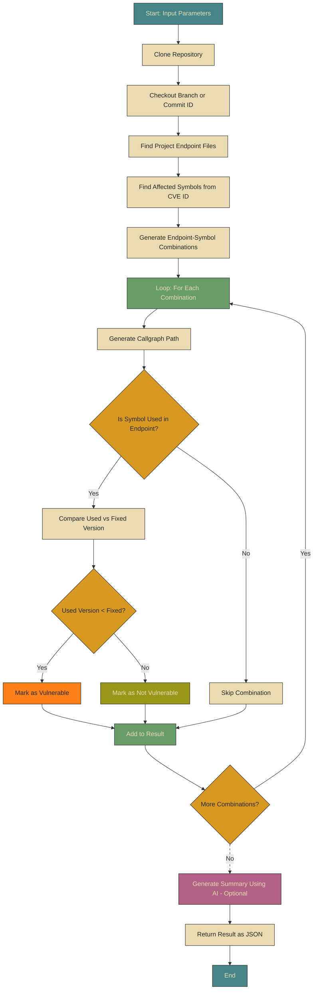

[](https://go.dev)
[](https://github.com/k37y/gvs/blob/main/LICENSE)
[](https://goreportcard.com/report/github.com/k37y/gvs)


Find vulnerability status from **Git repository URL**, **Git branch/commit**, and **CVE ID**
## Demo 1
[!demo-1](https://github.com/user-attachments/assets/3b013256-368f-45b1-8cd3-897173a48814)
## Demo 2
[](https://asciinema.org/a/721319)
## Flowchart

```mermaid
flowchart TD
    A[Start: Input Parameters] --> B[Clone Repository]
    B --> C[Checkout Branch or Commit ID]
    C --> D[Find Project Endpoint Files]
    D --> E[Find Affected Symbols from CVE ID]
    E --> F[Generate Endpoint-Symbol Combinations]
    F --> G[Loop: For Each Combination]
    G --> H[Generate Callgraph Path]
    H --> I{Is Symbol Used in Endpoint?}
    I -- Yes --> J[Compare Used vs Fixed Version]
    J --> K{Used Version < Fixed?}
    K -- Yes --> L[Mark as Vulnerable]
    K -- No --> M[Mark as Not Vulnerable]
    L --> N[Add to Result]
    M --> N
    I -- No --> O[Skip Combination]
    O --> N
    N --> P{More Combinations?}
    P -- Yes --> G
    P -- No --> Q[Generate Summary Using AI - Optional]
    Q --> R[Return Result as JSON]
    R --> S[End]

    %% Style nodes
    style A fill:#458588,stroke:#282828,stroke-width:1px,color:#ebdbb2
    style B fill:#ebdbb2,stroke:#282828,stroke-width:1px,color:#282828
    style C fill:#ebdbb2,stroke:#282828,stroke-width:1px,color:#282828
    style D fill:#ebdbb2,stroke:#282828,stroke-width:1px,color:#282828
    style E fill:#ebdbb2,stroke:#282828,stroke-width:1px,color:#282828
    style F fill:#ebdbb2,stroke:#282828,stroke-width:1px,color:#282828
    style G fill:#689d6a,stroke:#282828,stroke-width:1px,color:#ebdbb2
    style H fill:#ebdbb2,stroke:#282828,stroke-width:1px,color:#282828
    style I fill:#d79921,stroke:#282828,stroke-width:1px,color:#282828
    style J fill:#ebdbb2,stroke:#282828,stroke-width:1px,color:#282828
    style K fill:#d79921,stroke:#282828,stroke-width:1px,color:#282828
    style L fill:#fe8019,stroke:#282828,stroke-width:1px,color:#282828
    style M fill:#98971a,stroke:#282828,stroke-width:1px,color:#ebdbb2
    style N fill:#689d6a,stroke:#282828,stroke-width:1px,color:#ebdbb2
    style O fill:#ebdbb2,stroke:#282828,stroke-width:1px,color:#282828
    style P fill:#d79921,stroke:#282828,stroke-width:1px,color:#282828
    style Q fill:#b16286,stroke:#282828,stroke-width:1px,color:#ebdbb2
    style R fill:#ebdbb2,stroke:#282828,stroke-width:1px,color:#282828
    style S fill:#458588,stroke:#282828,stroke-width:1px,color:#ebdbb2
    linkStyle 18 stroke-width:1px,stroke-dasharray:5,5

%%    style white fill:#ebdbb2,stroke:#282828,stroke-width:1px,color:#282828
%%    style orange fill:#fe8019,stroke:#282828,stroke-width:1px,color:#282828
%%    style green fill:#98971a,stroke:#282828,stroke-width:1px,color:#ebdbb2
%%    style blue fill:#458588,stroke:#282828,stroke-width:1px,color:#ebdbb2
%%    style magenta fill:#b16286,stroke:#282828,stroke-width:1px,color:#ebdbb2
%%    style cyan fill:#689d6a,stroke:#282828,stroke-width:1px,color:#ebdbb2
%%    style yellow fill:#d79921,stroke:#282828,stroke-width:1px,color:#282828
```
## Prerequisites
* `podman`, `git`, `jq` and `make`

## Optional AI verification

AI verification is disabled by default. Enable it with `GVS_AI=1` and choose
an explicit provider and model. The verifier gives the model repository search,
source-reading, module-resolution, and call-graph tools, then validates its JSON
assessment. The scanner verdict remains separate from the AI assessment.

The audit compares the structured paths underlying graph SVGs with source to
identify supported paths and suspected false positives/negatives. It also traces
dynamic affected-symbol usage through reflection, unsafe operations, and
callbacks. Each `reflection_risks` entry must be supported, ruled out, or
explicitly unresolved; the audit can discover additional candidates. It does
not visually inspect SVG files or certify algorithm correctness.

| Variable | Purpose | Default |
|----------|---------|---------|
| `GVS_AI` | Set to `1` to enable verification | Disabled |
| `GVS_AI_PROVIDER` | `anthropic-vertex` or `openai-compatible` | Required when enabled |
| `GVS_AI_MODEL` | Model ID supported by the selected endpoint | Required when enabled |
| `GVS_AI_API_KEY` | Bearer token for an OpenAI-compatible endpoint | Required for api.openai.com; optional for other endpoints |
| `GVS_AI_BASE_URL` | API base URL, including any version prefix | `https://api.openai.com/v1` |
| `GVS_AI_PROJECT_ID` | Google Cloud project for `anthropic-vertex` | Required for Vertex |
| `GVS_AI_LOCATION` | Vertex region | `global` |
| `GVS_AI_MAX_ITERATIONS` | Investigation turns; each can contain multiple tool calls | `20` |
| `GVS_AI_MAX_TOKENS` | Maximum output tokens per request | `16384` |
| `GVS_AI_CONTEXT_TOKENS` | Context limit for the selected model; configure to match your endpoint | `131072` |
| `GVS_AI_TIMEOUT` | Overall verification timeout, in Go duration format | `10m` |
| `GVS_SKILLS_DIR` | Directory containing `verify-scan.md` | Installed or repository skills directory |

For a hosted or local OpenAI-compatible endpoint:

```bash
export GVS_AI=1
export GVS_AI_PROVIDER=openai-compatible
export GVS_AI_MODEL='<your-tool-capable-model>'
export GVS_AI_BASE_URL='https://your-provider.example/v1'
export GVS_AI_API_KEY='<your-api-key>'
./bin/cg -progress CVE-2024-45338 /path/to/repo
```

This backend sends requests to `<base-url>/chat/completions`. The endpoint and
model must support function tools, tool-result messages, `tool_choice: none`,
and `max_completion_tokens`. Compatibility depends on the endpoint and model;
this is not a native Responses API backend. See the
[official function-calling documentation](https://developers.openai.com/api/docs/guides/function-calling).

For Claude on Vertex, use Google Application Default Credentials:

```bash
export GVS_AI=1
export GVS_AI_PROVIDER=anthropic-vertex
export GVS_AI_MODEL='<your-vertex-model-id>'
export GVS_AI_PROJECT_ID='<your-google-cloud-project>'
export GVS_AI_LOCATION=global
./bin/cg -progress CVE-2024-45338 /path/to/repo
```

The verifier allows one final request with tools disabled after the investigation
limit. Invalid configuration, API failures, truncated responses, and invalid
assessments are reported in `Errors`. A failed investigation never supplies a verdict.
For scans with reflection risks, completed batch findings are retained and pending
risk indices are reported under `AIVerification.coverage`; incomplete coverage
produces an `unknown` assessment. A reviewed risk can still be unresolved.
Successful results include:

```json
{
  "AIVerification": {
    "provider": "openai-compatible",
    "model": "your-model-id",
    "IsVulnerable": "unknown",
    "confidence": "low",
    "reasoning": "The available evidence does not establish runtime reachability.",
    "evidence": ["find_callers: no path to a known entry point"],
    "graph_analysis": {
      "summary": "No path available to compare with source.",
      "findings": []
    },
    "dynamic_analysis": {
      "summary": "No supplied risk candidates; independent search incomplete.",
      "findings": []
    },
    "uncertainties": ["Dynamic entry-point reachability remains unverified."]
  }
}
```

`make image-run` reads `~/.config/gvs/gvs.env` (override with `AI_ENV_FILE`)
and forwards exported `GVS_AI*` settings. Exported settings override the file.
The user systemd service reads the same environment file. Vertex ADC credentials
are mounted read-only when present. The binaries themselves read environment
variables, not configuration files.

This replaces `GVS_CLAUDE`, `~/.claude.conf`, `ClaudeVerification`, and the old
Claude-specific feedback fields without compatibility aliases. Old saved results
are not migrated automatically.

All AI verification code lives in `pkg/cmd/cg/verify.go`: configuration, provider
adapters, repository tools, prompts, and assessment validation. The scanner only
calls `cg.VerifyAndSummarize(result, directory)`; that entry point also handles
enablement and progress logging. To add a backend, implement the private
`verificationAgent` interface and register its configuration and constructor in
that file. Verification tests live in `verify_test.go`.

CG collects dynamic candidates using the loaded Go type information, including
reflection aliases, exact affected function/method identities, function maps, and
unsafe memory operations. `reflection_risks[].association` distinguishes
`target_linked` evidence from `unresolved` operations. Unresolved candidates omit
`package` and `symbol`; generic method names and message strings are not treated
as affected-symbol evidence. Candidate detection is not a proof of runtime
reachability. Files importing `reflect` or `unsafe` without usable type information
retain explicit dynamic coverage gaps. Ordinary build/load failures remain in
`Errors` and do not create reflection-risk entries by themselves.

The verifier groups duplicate risk observations and investigates at most 16
original risk indices per batch, with a 6 KiB compact risk budget. It preserves
original scan indices and provides paginated `read_reflection_risks` access to full
evidence. `coverage` records total, reviewed, and pending risks outside the model.
Each batch uses a fresh conversation under the overall verification timeout.

Before each provider request, the verifier budgets the serialized request
(including schemas and accumulated history), reserves output tokens and a framing
margin, and attempts a final assessment as space runs low. The estimate uses one
input token per serialized byte; it is conservative for the supported protocols,
not a provider-specific tokenizer measurement. Set `GVS_AI_CONTEXT_TOKENS` to the
model's actual limit. Requests exceeding this local budget are not sent; pending
risks remain unreviewed. Graph excerpts are capped at 16 KiB with explicit
omission notices and graph tools available for follow-up.

Initial source context uses line-numbered excerpts around call sites, affected
symbols, and reflection locations, with a 32 KiB source budget and 4 KiB per file.
Each tool response is limited to 8 KiB. Omissions are explicitly marked, and the
model can request narrower file ranges or searches to recover needed evidence.
These are byte limits, not token limits; instructions, scan metadata, call traces,
tool schemas, and accumulated conversation history also contribute to input usage.

Use `cg -progress ...` to see initial prompt bytes and per-request and cumulative
token usage. Input totals include cached input; cache reads and writes are listed
separately when reported. Missing usage is marked unavailable, and cumulative
logs include reporting counts so partial totals are visible. These counters come
from received API responses, not billing records; SDK retries may incur additional
usage that was not returned. Missing or truncated evidence should lead to an
`unknown` assessment when a decisive question cannot be resolved.

## Tests

Run unit tests with race detection using `make test`. Both test targets require
Go and a C compiler for `-race`. Run the API and scanner integration suite with
`make test-integration`; it additionally requires Git, Graphviz (`sfdp`), and
network access to GitHub and vuln.go.dev.

Scanner fixtures come from [k37y/gvs-testdata](https://github.com/k37y/gvs-testdata).
The tests cover CVE and manual scans, all four algorithms, unreachable and
test-only calls, initialization, goroutines, deferred and generic calls, reflection
in helper packages, resolved dependency versions, replacement modules, version
boundaries, incomplete analysis, graph paths, and scan lifecycle behavior.
`make test-integration` enables `-race` for both the API test process and the
scanner subprocess. The suite checks multiple modules and affected packages
with 1, 4, and 8 workers. See [the test data notes](internal/api/testdata/README.md)
for validating fixture changes in a local checkout.

Scans compare dependency versions selected by Go, including transitive upgrades.
Incomplete package loading produces an unknown result. A reachable symbol in a
versioned replacement from a different module also produces unknown, because
the original module’s advisory versions do not establish whether the fork is fixed.

## Usage
### Build and run as a container image
```bash
$ git clone https://github.com/k37y/gvs && cd gvs
$ make image-run
```
### Sample API request and response of callgraph path
```bash
$ curl --request POST \
       --header "Content-Type: application/json" \
       --data '{"repo": "https://github.com/k37y/gvs-example-one", "branch": "main", "cve": "CVE-2024-45338"}' \
       http://localhost:8082/callgraph | jq .
```
```bash
{
  "taskId": "1748493013100462517"
}
```
```bash
$ curl --silent \
       --request POST \
       --header "Content-Type: application/json" \
       --data '{"taskId":"1748493013100462517"}' \
       http://localhost:8082/status | jq .output
```
```bash
{
  "AffectedImports": {
    "golang.org/x/net/html": {
      "FixedVersion": [
        "v0.33.0"
      ],
      "Symbols": [
        "Parse",
        "ParseFragment",
        "ParseFragmentWithOptions",
        "ParseWithOptions",
        "htmlIntegrationPoint",
        "inBodyIM",
        "inTableIM",
        "parseDoctype"
      ],
      "Type": "non-stdlib"
    }
  },
  "Branch": "main",
  "CVE": "CVE-2024-45338",
  "Directory": "/tmp/cg-gvs-example-one-2212737432",
  "Errors": null,
  "Files": {
    ".": [
      [
        "main.go"
      ]
    ]
  },
  "GoCVE": "GO-2024-3333",
  "IsVulnerable": "true",
  "Repository": "https://github.com/k37y/gvs-example-one",
  "Summary": "## Vulnerability Report Summary

The project is vulnerable to CVE-2024-45338 (GO-2024-3333) due to the use of `golang.org/x/net/html` at version `v0.23.0`.

The following symbols from the `golang.org/x/net/html` package are used in the codebase: `Parse`, `ParseWithOptions`, `htmlIntegrationPoint`, `inBodyIM`, `inTableIM`, and `parseDoctype`.

To remediate this vulnerability, update `golang.org/x/net/html` to version `v0.24.0` or higher. The recommended fix commands are:


go mod edit -replace=golang.org/x/net=golang.org/x/net@v0.33.0
go mod tidy
go mod vendor


No errors or issues were encountered during the scanning process.
",
  "UsedImports": {
    "golang.org/x/net/html": {
      "CurrentVersion": "v0.23.0",
      "FixCommands": [
        "go mod edit -replace=golang.org/x/net=golang.org/x/net@v0.33.0",
        "go mod tidy",
        "go mod vendor"
      ],
      "ReplaceVersion": "v0.24.0",
      "Symbols": [
        "Parse",
        "ParseWithOptions",
        "htmlIntegrationPoint",
        "inBodyIM",
        "inTableIM",
        "parseDoctype"
      ]
    }
  }
}
```
## Branch and Commit Support

The scanner supports both **branch names** and **commit hashes** for repository analysis:

### Using Branch Names
```bash
# API request with branch name
{
  "repo": "https://github.com/example/repo",
  "branchOrCommit": "main",           # ← Branch name
  "cve": "CVE-2024-45339"
}
```

### Using Commit Hashes
```bash
# API request with commit hash
{
  "repo": "https://github.com/example/repo", 
  "branchOrCommit": "abc123f",        # ← Commit hash (7+ hex characters)
  "cve": "CVE-2024-45339"
}
```

### How It Works

- **Branch Detection**: Names containing non-hex characters (e.g., `main`, `feature/test`, `release-4.18`)
- **Commit Detection**: 7-40 character strings containing only hexadecimal characters (0-9, a-f, A-F)
- **Performance**: Branch cloning uses `--depth 1` for speed, commit cloning uses full history to ensure commit accessibility

### Examples

| Input | Detected As | Clone Method |
|-------|-------------|--------------|
| `main` | Branch | `git clone --depth 1 --branch main` |
| `feature/auth` | Branch | `git clone --depth 1 --branch feature/auth` |
| `abc123f` | Commit | `git clone` → `git checkout abc123f` |
| `1a2b3c4d5e6f7a8b` | Commit | `git clone` → `git checkout 1a2b3c4d5e6f7a8b` |

## Advanced usage
### Call Graph Algorithm Configuration
The scanner supports multiple call graph algorithms, configurable via the `ALGO` environment variable:

| Algorithm | Speed | Precision | Description | Use Case |
|-----------|-------|-----------|-------------|----------|
| `vta` (default) | Slowest | Highest | Variable Type Analysis | When accuracy is critical |
| `rta` | Medium | Good | Rapid Type Analysis | Balanced performance |
| `cha` | Fast | Lower | Class Hierarchy Analysis | Large codebases where speed matters |
| `static` | Fastest | Lowest | Static analysis (direct calls only) | Quick scans |

```bash
# Example: Use Rapid Type Analysis for better performance
export ALGO=rta
make image-run

# Example: Use algorithm directly with cg binary
./bin/cg -algo rta CVE-2024-45338 /path/to/repo
./bin/cg -algo=static CVE-2024-45338 /path/to/repo

# Combine with other flags
./bin/cg -fix -algo cha CVE-2024-45338 /path/to/repo

# Get help
./bin/cg -h
```

### Build custom container image
* `PORT` specifies the port on which the application will run  
* `WORKER_COUNT` sets the size of the worker pool used to process endpoint and symbol combinations (optional)
* `ALGO` sets the call graph analysis algorithm: vta, rta, cha, static (optional, defaults to vta)

Each parameter is independent and can be set or omitted as needed:
```bash
# Build with all parameters
make image-run PORT=8082 WORKER_COUNT=3 ALGO=rta

# Build with only worker count
make image-run WORKER_COUNT=5

# Build with only algorithm choice
make image-run ALGO=static

# Build with defaults (vta algorithm, auto worker count)
make image-run
```
### Install as binary
```
$ go install github.com/k37y/gvs/cmd/gvs@main
$ go install github.com/k37y/gvs/cmd/cg@main
```
### ReflectionRisks
1. Type (string)
All 14 possible values:
```
"value_of" - reflect.ValueOf() usage
"method_by_name" - obj.MethodByName() calls
"type_method_by_name" - Type.MethodByName() calls
"call_slice" - Variadic function calls via reflection
"method_by_index" - Method(i) calls by index
"field_by_name" - FieldByName() calls
"indirect" - reflect.Indirect() calls
"new_at" - reflect.NewAt() calls (unsafe)
"convert" - Type conversion via reflection
"interface" - Interface() conversion calls
"function_registry" - Function maps/registries
"string_literal" - String literals with vulnerable symbols
"reflection_assignment" - Assignments involving reflection
"selector_access" - Direct field/method access
```
2. Confidence (string)
3 possible values:
```
"high" - Used for: value_of, method_by_name, call_slice, new_at
"medium" - Used for: type_method_by_name, method_by_index, field_by_name, indirect, interface, function_registry, reflection_assignment
"low" - Used for: convert, string_literal, selector_access
```
3. Location (string)
```
Format: "filepath:line:column"
Example: "/path/to/file.go:123:45"
```
4. Evidence ([]string)
Possible values (examples from code):
```
["reflect.ValueOf(symbolName)"]
["MethodByName(\"methodName\")"]
["Type.MethodByName(\"methodName\")"]
["CallSlice with symbolName"]
["Method call by index - potential vulnerable symbol"]
["FieldByName(\"fieldName\")"]
["reflect.Indirect - potential vulnerable symbol access"]
["reflect.NewAt - unsafe pointer creation"]
["Type conversion - potential symbol access"]
["Interface() conversion - potential symbol access"]
["Function registry with vulnerable symbols"]
["String literal: \"literalValue\""]
["Assignment involving reflection - potential symbol storage"]
["Direct access to symbolName"]
```
5. Symbol (string)
Possible values:
```
Actual vulnerable symbols: Any symbol from the CVE (e.g., "Do", "Client.Do", "RoundTrip")
Generic identifiers:
"reflection_assignment"
"method_by_index"
"indirect_access"
"unsafe_new_at"
"type_convert"
"interface_convert"
"function_registry"
```
6. Package (string)
Values: The package being analyzed (passed as parameter)
```
Examples: "net/http", "golang.org/x/net/http2", "main", etc.
The values are determined by the specific vulnerability symbols being searched for and the package context where the reflection usage is detected.
```
