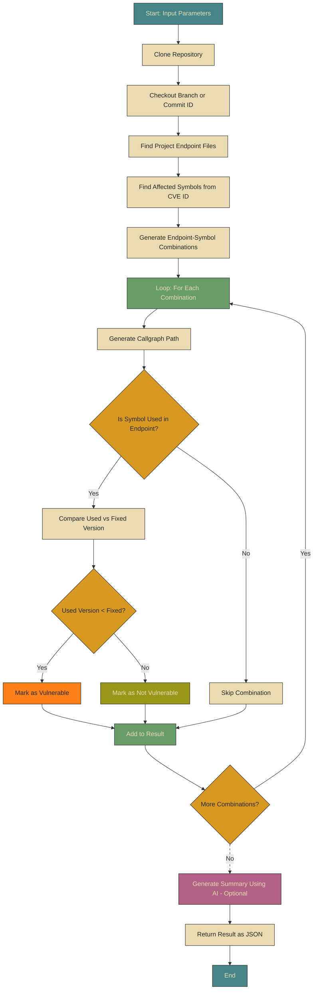

[](https://go.dev)
[](https://github.com/k37y/gvs/blob/main/LICENSE)
[](https://goreportcard.com/report/github.com/k37y/gvs)


Find vulnerability status from **Git repository URL**, **Git branch/commit**, and **CVE ID**

The web UI streams progress during a scan and replaces it with the complete scanner log on completion, including when loading a cached result.

## Demo 1
[!demo-1](https://github.com/user-attachments/assets/3b013256-368f-45b1-8cd3-897173a48814)
## Demo 2
[](https://asciinema.org/a/721319)
## Flowchart

```mermaid
flowchart TD
    A[Start: Input Parameters] --> B[Clone Repository]
    B --> C[Checkout Branch or Commit ID]
    C --> D[Find Project Endpoint Files]
    D --> E[Find Affected Symbols from CVE ID]
    E --> F[Generate Endpoint-Symbol Combinations]
    F --> G[Loop: For Each Combination]
    G --> H[Generate Callgraph Path]
    H --> I{Is Symbol Used in Endpoint?}
    I -- Yes --> J[Compare Used vs Fixed Version]
    J --> K{Used Version < Fixed?}
    K -- Yes --> L[Mark as Vulnerable]
    K -- No --> M[Mark as Not Vulnerable]
    L --> N[Add to Result]
    M --> N
    I -- No --> O[Skip Combination]
    O --> N
    N --> P{More Combinations?}
    P -- Yes --> G
    P -- No --> Q[Generate Summary Using AI - Optional]
    Q --> R[Return Result as JSON]
    R --> S[End]

    %% Style nodes
    style A fill:#458588,stroke:#282828,stroke-width:1px,color:#ebdbb2
    style B fill:#ebdbb2,stroke:#282828,stroke-width:1px,color:#282828
    style C fill:#ebdbb2,stroke:#282828,stroke-width:1px,color:#282828
    style D fill:#ebdbb2,stroke:#282828,stroke-width:1px,color:#282828
    style E fill:#ebdbb2,stroke:#282828,stroke-width:1px,color:#282828
    style F fill:#ebdbb2,stroke:#282828,stroke-width:1px,color:#282828
    style G fill:#689d6a,stroke:#282828,stroke-width:1px,color:#ebdbb2
    style H fill:#ebdbb2,stroke:#282828,stroke-width:1px,color:#282828
    style I fill:#d79921,stroke:#282828,stroke-width:1px,color:#282828
    style J fill:#ebdbb2,stroke:#282828,stroke-width:1px,color:#282828
    style K fill:#d79921,stroke:#282828,stroke-width:1px,color:#282828
    style L fill:#fe8019,stroke:#282828,stroke-width:1px,color:#282828
    style M fill:#98971a,stroke:#282828,stroke-width:1px,color:#ebdbb2
    style N fill:#689d6a,stroke:#282828,stroke-width:1px,color:#ebdbb2
    style O fill:#ebdbb2,stroke:#282828,stroke-width:1px,color:#282828
    style P fill:#d79921,stroke:#282828,stroke-width:1px,color:#282828
    style Q fill:#b16286,stroke:#282828,stroke-width:1px,color:#ebdbb2
    style R fill:#ebdbb2,stroke:#282828,stroke-width:1px,color:#282828
    style S fill:#458588,stroke:#282828,stroke-width:1px,color:#ebdbb2
    linkStyle 18 stroke-width:1px,stroke-dasharray:5,5

%%    style white fill:#ebdbb2,stroke:#282828,stroke-width:1px,color:#282828
%%    style orange fill:#fe8019,stroke:#282828,stroke-width:1px,color:#282828
%%    style green fill:#98971a,stroke:#282828,stroke-width:1px,color:#ebdbb2
%%    style blue fill:#458588,stroke:#282828,stroke-width:1px,color:#ebdbb2
%%    style magenta fill:#b16286,stroke:#282828,stroke-width:1px,color:#ebdbb2
%%    style cyan fill:#689d6a,stroke:#282828,stroke-width:1px,color:#ebdbb2
%%    style yellow fill:#d79921,stroke:#282828,stroke-width:1px,color:#282828
```
## Prerequisites
* `podman`, `git`, `jq` and `make`

## Runtime storage

Set `GVS_DATA_DIR` to an absolute directory writable by the server user to keep
GVS runtime files together:

```bash
GVS_DATA_DIR=/srv/gvs-data ./bin/gvs
```

| Variable | Purpose | Default |
| --- | --- | --- |
| `GVS_DATA_DIR` | Root directory for server writes, including child scanner/tool caches and temporary files | Unset; preserves existing locations |

The server creates these subdirectories:

| Directory | Contents |
| --- | --- |
| `tmp/` | Repository clones, task result artifacts, and temporary files (including Go build work) |
| `cache/gvs/` | Cached scan JSON and logs |
| `graph/` | Generated SVG call graphs served at `/graph/` |
| `go-build/` | Go build cache |
| `go/` | Go workspace, module/toolchain downloads, and tool installation directory |
| `cache/` | Other XDG tool caches |
| `config/` | XDG tool configuration and Go telemetry data |

When set, `GVS_DATA_DIR` takes precedence over inherited `GOCACHE`, `GOMODCACHE`,
`GOPATH`, `GOBIN`, `GOTMPDIR`, `TMPDIR`, `TMP`, `TEMP`, `XDG_CACHE_HOME`,
`XDG_CONFIG_HOME`, and `GVS_GRAPH_CACHE`. Go telemetry is redirected using the
toolchain's `TEST_TELEMETRY_DIR` override. Cleanup uses the configured temporary
directory. Existing files are not migrated. Logs written to stdout/stderr remain
managed by your terminal, container runtime, or service manager.

This setting applies to the `gvs` server and tools it launches. Standalone `cg`
continues to use its Go environment and explicit `-graph` output path.
Without `GVS_DATA_DIR`, scan caches remain in `/tmp/gvs-cache`, temporary files
use the OS temporary directory, and graphs use the existing XDG/home cache path.

For containers, mount a writable volume and set the path inside the container:

```bash
podman run --rm -p 8082:8082 \
  -v gvs-data:/data -e GVS_DATA_DIR=/data quay.io/k37y/gvs:latest
```

`make image-run` also forwards an exported `GVS_DATA_DIR` or reads it from
`~/.config/gvs/gvs.env`. Add a volume through `RUN_OPTS` if persistence is needed.

## Optional AI verification

AI verification is disabled by default. Enable it with `GVS_AI=1` and choose
an explicit provider and model. The verifier gives the model repository search,
source-reading, module-resolution, and call-graph tools, then validates its JSON
assessment. The scanner verdict remains separate from the AI assessment and is
withheld from the AI prompt to reduce anchoring. The AI receives structured
candidate paths for source review; SVG URLs are omitted. Dispatch edges need
source evidence about the actual function value or receiver. Indirect dependencies
and absent direct imports alone do not establish non-use. The verifier checks
indirect-edge reviews against graph call sites and source lines supplied in the
investigation. Unsupported paths become inconclusive; an otherwise unsupported
verdict becomes `unknown`. A negative verdict requires reviewing all reported
paths, citing the alternate-path checks, and resolving relevant dynamic candidates.
Checked refutations are reused for scanner paths sharing the same module and exact
path prefix through the refuted edge. Different calling contexts still need review.
Supported dynamic calls and missed graph paths require checked source citations.
Dependency source can be read using scanner-indexed absolute file paths.
The `inspect_dispatch` tool follows SSA callback/receiver origins through caller
arguments, captured variables, assignments, and conversions. It also reads the
corresponding call-site and origin lines, returning exact source quotes usable
in dispatch reviews. Quotes have a 4 KiB budget within the 8 KiB tool limit;
omitted source and surrounding context remain available through `read_file`.
Only complete quotes delivered to the model count as citation evidence. SSA hints
alone do not establish reachability. One checked impossible edge can refute a path;
other paths and relevant alternative routes still need review.
Traces label the required `edge_reviews.step`; correction feedback distinguishes
missing reviews from mismatched steps or call sites and lists uncovered paths
before detailed diagnostics. Dispatch inspection distinguishes static closure
calls from indirect callback invocations. A refutation attached to a static call
is rejected with feedback identifying that call and the indirect candidate steps.
An inconclusive graph finding or unresolved dynamic
finding with no uncertainty gets an explicit verifier gap and stays unresolved,
so that omission does not discard other valid findings in the same response.
For synthetic edges from `reflect.Value.Call` or `CallSlice`, reviews cite the
actual reflection invocation in the preceding path caller and the selected value.
`inspect_dispatch` accepts `reflection_caller` to retrieve that source and trace
`ValueOf`, `MethodByName`, and `Method` arguments. Every matching site in that
caller needs evidence for a refutation; it cannot exclude other callers of the
reflection API. The static call into the reflection API remains valid even when
the following synthetic target edge is excluded.
If an early assessment leaves a synthetic reflection path unresolved, the verifier
can continue the investigation once with exact `inspect_dispatch` arguments for
up to four unattempted edges. This uses the existing conversation and limits;
the later assessment correction still disables tools. Already inspected edges
and validated path refutations do not trigger this continuation. Missing evidence
still leaves the verdict unknown.
These checks validate evidence provenance and coverage; source-flow interpretation
still depends on the model. Citation objects and `file:line: exact source` strings
undergo the same source checks; incomplete required citations remain unverified
without discarding the entire assessment. Internal edge reviews do not add public
JSON fields. Structured `source_path` steps with a source location are normalized
for both graph and dynamic findings without changing evidence validation. When a
verdict is withheld, the report summarizes unresolved targets and missing checks,
retains source citations, and avoids repeating finding explanations in the
reasoning. Full routes and dispatch inventories remain in the internal audit and
validation feedback rather than being copied into the public assessment.

The audit compares the structured paths underlying graph SVGs with source to
identify supported paths and suspected false positives/negatives. It also traces
dynamic affected-symbol usage through reflection, unsafe operations, and
callbacks. Each `reflection_risks` entry must be supported, ruled out, or
explicitly unresolved; the audit can discover additional candidates. It does
not visually inspect SVG files or certify algorithm correctness.

| Variable | Purpose | Default |
|----------|---------|---------|
| `GVS_AI` | Set to `1` to enable verification | Disabled |
| `GVS_AI_PROVIDER` | `anthropic-vertex` or `openai-compatible` | Required when enabled |
| `GVS_AI_MODEL` | Model ID supported by the selected endpoint | Required when enabled |
| `GVS_AI_API_KEY` | Bearer token for an OpenAI-compatible endpoint | Required for api.openai.com; optional for other endpoints |
| `GVS_AI_BASE_URL` | API base URL, including any version prefix | `https://api.openai.com/v1` |
| `GVS_AI_PROJECT_ID` | Google Cloud project for `anthropic-vertex` | Required for Vertex |
| `GVS_AI_LOCATION` | Vertex region | `global` |
| `GVS_AI_MAX_ITERATIONS` | Investigation turns; each can contain multiple tool calls | `20` |
| `GVS_AI_MAX_TOKENS` | Maximum output tokens per request | `16384` |
| `GVS_AI_CONTEXT_TOKENS` | Context limit for the selected model; configure to match your endpoint (not detected automatically) | `131072`, including when empty |
| `GVS_AI_TIMEOUT` | Overall verification timeout, in Go duration format | `10m` |
| `GVS_AI_PRICING` | JSON object of USD rates per million tokens: `input` (uncached), `output`, `cache_read`, `cache_write` | Unset; costs are `null` |
| `GVS_SKILLS_DIR` | Directory containing `verify-scan.md` | Installed or repository skills directory |

For a hosted or local OpenAI-compatible endpoint:

```bash
export GVS_AI=1
export GVS_AI_PROVIDER=openai-compatible
export GVS_AI_MODEL='<your-tool-capable-model>'
export GVS_AI_BASE_URL='https://your-provider.example/v1'
export GVS_AI_API_KEY='<your-api-key>'
./bin/cg -progress CVE-2024-45338 /path/to/repo
```

This backend sends requests to `<base-url>/chat/completions`. The endpoint and
model must support function tools, tool-result messages, `tool_choice: none`,
and `max_completion_tokens`. Compatibility depends on the endpoint and model;
this is not a native Responses API backend. See the
[official function-calling documentation](https://developers.openai.com/api/docs/guides/function-calling).

For Claude on Vertex, use Google Application Default Credentials:

```bash
export GVS_AI=1
export GVS_AI_PROVIDER=anthropic-vertex
export GVS_AI_MODEL='<your-vertex-model-id>'
export GVS_AI_PROJECT_ID='<your-google-cloud-project>'
export GVS_AI_LOCATION=global
./bin/cg -progress CVE-2024-45338 /path/to/repo
```

The verifier allows one final request with tools disabled after the investigation
limit. If an assessment fails validation, it permits one additional correction
using exact feedback and the existing conversation, with tools disabled. This
request uses the same timeout/context budget and contributes to reported usage.
If correction fails, an already validated partial assessment is retained.
Invalid configuration, API failures, truncated responses, and invalid
assessments are reported in `Errors`. A failed investigation never supplies a verdict.
For scans with reflection risks, structured findings and risk coverage are retained
internally for validation. A validated positive invocation preserves `true` despite
unrelated unresolved or unreviewed risks and failed batches. Otherwise, incomplete
coverage produces `unknown`. The unreviewed risk count and failure details remain
included in `reasoning`. A reviewed risk can still be unresolved. Public
`AIVerification` contains only `IsVulnerable`,
`confidence`, `evidence`, `reasoning`, and `usage`. Decisive finding evidence is included
in `evidence`, and remaining gaps are included in `reasoning`.

The audit focuses on algorithm overapproximation and missed affected-symbol usage,
especially reflection. The first investigation reviews shared graph paths and
searches source beyond scanner-generated candidates. Later reflection batches
investigate their own candidates and connected paths, using graph tools for focused
comparisons. They do not repeat the shared graph review. Each batch verdict applies
to its assigned scope; an overall negative requires agreement from the initial
audit and every batch, with no failed or pending investigation. Initial source
excerpts also include reflection/unsafe helpers within the existing source budget,
even when those helpers do not import the affected package.

Public `evidence` includes labeled path and dynamic findings with their explanations,
so a suspected false-positive path or missed reflection invocation remains visible
even when the overall verdict is `unknown`. These findings establish what was
checked within the audit scope; they do not guarantee complete discovery.

Successful results include:

```json
{
  "AIVerification": {
    "IsVulnerable": "false",
    "confidence": "high",
    "evidence": ["main_test.go:3: the only invocation is in a test"],
    "reasoning": "The affected symbol is called only from tests; no affected invocation was found in the reviewed production scope.",
    "usage": {
      "input_tokens": 35172,
      "output_tokens": 1000,
      "cache_read_tokens": 16768,
      "cache_write_tokens": null,
      "cost_usd": null
    }
  }
}
```

`make image-run` reads `~/.config/gvs/gvs.env` (override with `AI_ENV_FILE`)
and forwards exported `GVS_AI*` settings and the MCP/task settings documented
below. Exported settings override the file.
The user systemd service reads the same environment file. Vertex ADC credentials
are mounted read-only when present. The binaries themselves read environment
variables, not configuration files.

This replaces `GVS_CLAUDE`, `~/.claude.conf`, `ClaudeVerification`, and the old
Claude-specific feedback fields without compatibility aliases. Old saved results
are not migrated automatically.

All AI verification code lives in `pkg/cmd/cg/verify.go`: configuration, provider
adapters, repository tools, prompts, and assessment validation. The scanner only
calls `cg.VerifyAndSummarize(result, directory)`; that entry point also handles
enablement and progress logging. To add a backend, implement the private
`verificationAgent` interface and register its configuration and constructor in
that file. Verification tests live in `verify_test.go`.

CG collects dynamic candidates using the loaded Go type information, including
reflection aliases, exact affected function/method identities, function maps, and
unsafe memory operations. `reflection_risks[].association` distinguishes
`target_linked` evidence from `unresolved` operations. Unresolved candidates omit
`package` and `symbol`; generic method names and message strings are not treated
as affected-symbol evidence. Candidate detection is not a proof of runtime
reachability. Files importing `reflect` or `unsafe` without usable type information
retain explicit dynamic coverage gaps. Ordinary build/load failures remain in
`Errors` and do not create reflection-risk entries by themselves.

The verifier groups duplicate risk observations and investigates at most 16
original risk indices per batch, with a 6 KiB compact risk budget. It preserves
original scan indices and provides paginated `read_reflection_risks` access to full
evidence. Internal coverage records total, reviewed, and pending risks outside the model.
Each batch uses a fresh conversation under the overall verification timeout.

Before each provider request, the verifier budgets the serialized request
(including schemas and accumulated history), reserves output tokens and a framing
margin, and attempts a final assessment as space runs low. The estimate uses one
input token per serialized byte; it is conservative for the supported protocols,
not a provider-specific tokenizer measurement. Set `GVS_AI_CONTEXT_TOKENS` to the
model's actual limit. For OpenAI's GPT-4.1, use `GVS_AI_CONTEXT_TOKENS=1047576`
([model documentation](https://developers.openai.com/api/docs/models/gpt-4.1));
use a lower limit if your endpoint imposes one. Requests exceeding this local
budget are not sent; pending risks remain unreviewed. Graph excerpts are capped
at 16 KiB with explicit omission notices and graph tools available for follow-up.

During tool use, the verifier also reserves space for the final assessment prompt
and one correction: a 16 KiB serialized draft, up to 8 KiB of serialized validation
feedback, and correction instructions/framing. Tool results are shortened or
remaining calls skipped when necessary, with explicit notices. Complete history
is preserved, and larger drafts still face the request budget check. Missing-field
feedback identifies the analysis, finding index, and fields needing correction.

Initial source context uses line-numbered excerpts around call sites, affected
symbols, and reflection locations, with a 32 KiB source budget and 4 KiB per file.
Each tool response is limited to 8 KiB and the remaining conversation budget;
only complete source lines or quote records delivered within those limits count
as citations. Omissions are explicitly marked, and the model can request narrower
file ranges or searches to recover needed evidence while tools remain enabled.
These are byte limits, not token limits; instructions, scan metadata, call traces,
tool schemas, and accumulated conversation history also contribute to input usage.

Use `cg -progress ...` to see initial prompt bytes and per-request and cumulative
token usage. The enabled message includes the configured context limit. Progress
distinguishes a model returning an assessment early from GVS requesting one due
to the iteration limit or context reserve; correction still has tools disabled.
Input totals include cached input; cache reads and writes are listed
separately when reported. Missing usage is marked unavailable, and cumulative
logs include reporting counts so partial totals are visible. These counters come
from received API responses, not billing records; SDK retries may incur additional
usage that was not returned. Missing or truncated evidence should lead to an
`unknown` assessment when a decisive question cannot be resolved.

JSON results include `AIVerification.usage` with `input_tokens`, `output_tokens`,
`cache_read_tokens`, `cache_write_tokens`, and `cost_usd`, aggregated across all investigations,
including requests whose assessment fails to parse or validate. Input includes cache
reads and writes. Missing counters are `null`. Reported totals may be partial;
progress logs include reporting counts to show missing usage.

Set `GVS_AI_PRICING` to your endpoint's USD rates per million tokens to include
estimated costs. For example, using illustrative rates (not a model price list):

```bash
export GVS_AI_PRICING='{"input":3,"output":15,"cache_read":0.3,"cache_write":3.75}'
```

`usage.cost_usd` is the estimated total in USD, or `null` when rates or required
usage counters are missing. Input cost uses input minus cache reads and writes.
When `cache_write` pricing is explicitly zero and no request reports write tokens,
the estimate treats cache writes as having no separate billing category: input cost
uses input minus cache reads, and write cost is zero. The write token counter stays
`null`. Per-category costs and configured rates appear in progress logs.
Rates are configurable because endpoints, contracts, and cache retention policies
can differ. Estimates cover received usage reports rather than the provider's final bill.

## Tests

Run unit tests with race detection using `make test`. If the host lacks CGO or a
C compiler, use `make test-podman`. It runs the unit suite with CGO enabled in
`registry.access.redhat.com/ubi9/ubi`, installing Go, GCC, and Git with `dnf`;
only Make and Podman are required on the host (with a running Podman machine on
macOS). `GOTOOLCHAIN=auto` lets Go download a newer toolchain if required by
`go.mod`. The first run needs network access for the image and toolchain; package
installation needs network access on each run. The repository is mounted
read-only, and the `gvs-test-cache` Podman volume retains build, module, and
downloaded toolchain caches. Container exit failures propagate to Make.

Override `PODMAN_TEST_IMAGE` to use another compatible UBI base,
`PODMAN_TEST_CACHE` to choose a different cache volume, or `PODMAN_TEST_ARGS` to
select tests:

```bash
make test-podman
make test-podman PODMAN_TEST_ARGS='-race -count=1 -timeout=120s ./pkg/cmd/cg -run TestVerification'
```

The host-based test targets require Go and a C compiler for `-race`.
Run the API, scanner, and MCP integration suite with
`make test-integration`; it additionally requires Git, Graphviz (`sfdp`), and
network access to GitHub and vuln.go.dev.

Use `make test-integration-podman` when those tools or CGO are missing on the
host. It uses the same UBI image and installs Go, GCC, Git, and Graphviz with
`dnf`, then runs the same integration suite with race detection and a 45-minute
timeout. Go caches are shared with `test-podman`. Package installation and the
suite's external services require network access.

UBI's packaged Graphviz was observed to fail the scanner's SVG rendering command
with `Graphviz not built with triangulation library`. Integration cases that
render graphs can therefore fail even though Graphviz installs successfully.
Use `PODMAN_INTEGRATION_TEST_ARGS` for focused runs:

```bash
make test-integration-podman
make test-integration-podman PODMAN_INTEGRATION_TEST_ARGS='-race -count=1 -tags integration ./internal/api -run TestCgBinaryValidation -timeout=120s'
```

Scanner fixtures come from [k37y/gvs-testdata](https://github.com/k37y/gvs-testdata).
The tests cover CVE and manual scans, all four algorithms, unreachable and
test-only calls, initialization, goroutines, deferred and generic calls, reflection
in helper packages, resolved dependency versions, replacement modules, version
boundaries, incomplete analysis, graph paths, and scan lifecycle behavior.
`make test-integration` enables `-race` for both the API test process and the
scanner subprocess. The suite checks multiple modules and affected packages
with 1, 4, and 8 workers. See [the test data notes](internal/api/testdata/README.md)
for validating fixture changes in a local checkout.
The MCP integration cases exercise submission, polling, cancellation, and result
retrieval through the HTTP client without live AI requests.

Scans compare dependency versions selected by Go, including transitive upgrades.
Incomplete package loading produces an unknown result. A reachable symbol in a
versioned replacement from a different module also produces unknown, because
the original module’s advisory versions do not establish whether the fork is fixed.

## Usage
### Build and run as a container image
```bash
$ git clone https://github.com/k37y/gvs && cd gvs
$ make image-run
```

### MCP server

Enable the optional Streamable HTTP endpoint when starting GVS:

```bash
GVS_MCP=1 make run
```

Connect your MCP client to `http://localhost:8082/mcp`. The endpoint returns 404
when disabled. It uses the official Go MCP SDK, with stateless HTTP and JSON
responses. Scan tasks run in the background and are shared with the existing
REST API; only one scan runs at a time across both interfaces.

For a container, put the settings in `~/.config/gvs/gvs.env`, or export them before
running `make image-run`:

```bash
export GVS_MCP=1
export GVS_PUBLIC_URL='https://gvs.example.com'
make image-run
```

`GVS_PUBLIC_URL` is the externally reachable base URL used for graph links. A
reverse proxy must forward the `/mcp` endpoint and `/graph/` paths. MCP requests
only submit work or retrieve status/results; they do not keep an HTTP request
open for the entire scan. Deploy on a trusted network or behind an access proxy;
GVS does not provide MCP authentication or per-user task isolation.

| Variable | Description | Default |
| --- | --- | --- |
| `GVS_MCP` | Set to `1` to enable `/mcp` | Disabled |
| `GVS_MCP_ALLOWED_ORIGINS` | Comma-separated, exact HTTP(S) browser origins; for example `https://assistant.example.com` | Empty |
| `GVS_PUBLIC_URL` | Public HTTP(S) base URL for graph links | Derived from the request/proxy configuration |
| `GVS_SCAN_TIMEOUT` | Maximum task duration, including cloning and AI verification, in Go duration format | `30m` |
| `GVS_TASK_TTL` | Retention after a task reaches a terminal state, in Go duration format | `24h` |

Requests without an `Origin` header are accepted. Browser requests must have an
exactly allowlisted origin; malformed or unlisted origins are rejected.
`GVS_MCP_ALLOWED_ORIGINS` does not accept `*` and is independent of the REST
`CORS_ALLOWED_ORIGINS` setting. Browser preflights support MCP request headers.
AI verification remains controlled by the server's existing `GVS_AI*` settings.

| MCP tool | Required arguments | Optional arguments |
| --- | --- | --- |
| `gvs_scan` | `repo`, `branch`, `cve`, `algo` | `requestId` |
| `gvs_manual_scan` | `repo`, `branch`, `library`, `symbol`, `fixedVersion`, `algo` | `requestId` |
| `gvs_status` | `taskId` | — |
| `gvs_cancel` | `taskId` | — |
| `gvs_read_result` | `taskId` | `cursor` |

Required arguments are nonempty strings. `repo` must be an HTTP(S) Git repository
URL; `branch` accepts a branch name or commit hash and maps to the REST
`branchOrCommit` field. `cve` accepts a CVE or GO vulnerability identifier. Both
scan tools require `algo` to be `rta`, `vta`, `cha`, or `static`. Manual scans accept
comma-separated `symbol` values and the existing fixed-version syntax;
`fixedVersion` maps to `fixversion`. Both tools perform call-graph analysis;
there is no MCP tool for the separate govulncheck `/scan` workflow.

An optional `requestId` of at most 128 characters makes submission retries
idempotent. Reuse it with the same execution arguments to retrieve the original
task; reusing it with different arguments is an error. A busy rejection does not
reserve the key. Tasks, cancellation state, and retry keys are process-local:
they disappear on restart and expire after the configured retention period.
Disconnecting from MCP does not cancel an accepted scan.

Server logs on stderr use `[MCP]` for tool names, call durations and error flags;
`[API]` for REST request methods, paths and durations; and `[Task <taskId>]` for
shared scan lifecycle changes and cache hits. Request logs are emitted when
the call finishes; a progress stream logs when it closes. Bodies, query strings,
headers, tool arguments and result contents are omitted from these request logs.
Both `[API]` and `[MCP]` request logs include `remote_ip`, taken from the
connection address without its port. Forwarded IP headers are ignored; behind
a reverse proxy, this records the proxy's address.
Detailed scanner logs remain available in the task result's `logs` field,
including for cached results.

#### Submit, poll, and read a result

The following examples show MCP tool arguments and their structured result
payloads, without the JSON-RPC envelope. The same result JSON is also returned
as text content for clients that do not consume structured content.

Call `gvs_scan` with:

```json
{
  "repo": "https://github.com/k37y/gvs-example-one",
  "branch": "main",
  "cve": "CVE-2024-45338",
  "algo": "rta",
  "requestId": "example-scan-1"
}
```

The tool immediately returns a task ID and polling guidance, for example:

```json
{
  "taskId": "example-task-id",
  "status": "pending",
  "pollAfterSeconds": 5,
  "message": "Scan accepted and still processing; it may take several minutes. Call gvs_status after 5 seconds."
}
```

Wait five seconds, then call `gvs_status` with
`{"taskId":"example-task-id"}`. While `status` is `pending` or `running`, wait
`pollAfterSeconds` and repeat the status call. The client or calling agent must
implement this loop; a scan can take several minutes. A timed-out status request
can be retried with the same task ID. Stop polling at `completed`, `failed`, or
`cancelled`; terminal results omit polling guidance.

To stop work, call `gvs_cancel` with the task ID, then poll until terminal. The
cancel tool acknowledges the request; terminal cancellation waits for the worker
to exit and logs to be collected. Repeated cancellation is harmless and cannot
overwrite an already completed task. A scan timeout is reported as `failed` with
an explicit execution error.

`gvs_status` returns the task ID, status, UTC `createdAt`/`updatedAt` timestamps,
and `cached`. Terminal results also include `completedAt` and `expiresAt`.
When scan output is available, `summary` keeps the scanner and AI assessments
separate. For a scanner-positive, AI-negative result it is:

```json
{
  "scannerVerdict": "true",
  "aiVerdict": "false",
  "aiConfidence": "high",
  "verdictsDisagree": true
}
```

These fields derive from `output.IsVulnerable` and
`output.AIVerification.IsVulnerable`/`confidence`; they do not replace either
assessment or create a combined verdict. Verdicts are strings (`"true"`,
`"false"`, `"unknown"`) or `null` when unavailable/unrecognized.
`verdictsDisagree` is `null` unless both verdicts are definite. Confidence is
`"high"`, `"medium"`, or `"low"`; missing or unrecognized confidence is `null`.
Non-JSON output is preserved as a string without a summary.

For results that fit inline, `output` contains the full original scanner JSON,
including AI evidence, reasoning and usage, reflection risks, suggested fixes,
graph links, and any future fields. Execution failures appear in `error`;
scanner diagnostics remain in `output.Errors`. A successful status lookup can
return a failed scan. Available logs are retained for fresh and cached results.
`cached: true` means the output, AI usage, and evidence belong to a previous
analysis; task timestamps describe the current submission.

The `result` field reports `available`, `inline`, and, once available,
`totalBytes` for the immutable complete-result JSON artifact. That artifact
contains the available `output`, `error`, and `logs`. It remains retrievable until
the task expires. If the serialized MCP result would exceed 64 KiB, counting
both structured and text content, status omits those fields and lists them in
`result.externalFields`. The summary and retrieval guidance remain available;
the underlying result is not truncated.

To retrieve an external result, call `gvs_read_result` with the task ID. Each
response includes `taskId`, `content`, `nextCursor`, and `eof`. Append each decoded
`content` string verbatim, use `nextCursor` for the next call, and stop at
`eof: true`; parse the concatenated text as JSON. Chunks contain at most 16 KiB of
UTF-8 text and may be smaller to respect the serialized response limit.
Replaying a cursor returns the same content. Cursors are bound to their task and
artifact; invalid or expired cursors return errors. Graph URLs link to SVG files
which clients fetch separately.

Unknown task IDs, invalid arguments, busy submissions, and invalid cursors return
MCP tool errors. Native MCP Tasks, stdio transport, durable tasks, progress
subscriptions, and local-directory scans are outside this interface.

### Sample API request and response of callgraph path
```bash
$ curl --request POST \
       --header "Content-Type: application/json" \
       --data '{"repo": "https://github.com/k37y/gvs-example-one", "branch": "main", "cve": "CVE-2024-45338"}' \
       http://localhost:8082/callgraph | jq .
```
```bash
{
  "taskId": "1748493013100462517"
}
```
```bash
$ curl --silent \
       --request POST \
       --header "Content-Type: application/json" \
       --data '{"taskId":"1748493013100462517"}' \
       http://localhost:8082/status | jq .output
```
```bash
{
  "AffectedImports": {
    "golang.org/x/net/html": {
      "FixedVersion": [
        "v0.33.0"
      ],
      "Symbols": [
        "Parse",
        "ParseFragment",
        "ParseFragmentWithOptions",
        "ParseWithOptions",
        "htmlIntegrationPoint",
        "inBodyIM",
        "inTableIM",
        "parseDoctype"
      ],
      "Type": "non-stdlib"
    }
  },
  "Branch": "main",
  "CVE": "CVE-2024-45338",
  "Directory": "/tmp/cg-gvs-example-one-2212737432",
  "Errors": null,
  "Files": {
    ".": [
      [
        "main.go"
      ]
    ]
  },
  "GoCVE": "GO-2024-3333",
  "IsVulnerable": "true",
  "Repository": "https://github.com/k37y/gvs-example-one",
  "Summary": "## Vulnerability Report Summary

The project is vulnerable to CVE-2024-45338 (GO-2024-3333) due to the use of `golang.org/x/net/html` at version `v0.23.0`.

The following symbols from the `golang.org/x/net/html` package are used in the codebase: `Parse`, `ParseWithOptions`, `htmlIntegrationPoint`, `inBodyIM`, `inTableIM`, and `parseDoctype`.

To remediate this vulnerability, update `golang.org/x/net/html` to version `v0.24.0` or higher. The recommended fix commands are:


go mod edit -replace=golang.org/x/net=golang.org/x/net@v0.33.0
go mod tidy
go mod vendor


No errors or issues were encountered during the scanning process.
",
  "UsedImports": {
    "golang.org/x/net/html": {
      "CurrentVersion": "v0.23.0",
      "FixCommands": [
        "go mod edit -replace=golang.org/x/net=golang.org/x/net@v0.33.0",
        "go mod tidy",
        "go mod vendor"
      ],
      "ReplaceVersion": "v0.24.0",
      "Symbols": [
        "Parse",
        "ParseWithOptions",
        "htmlIntegrationPoint",
        "inBodyIM",
        "inTableIM",
        "parseDoctype"
      ]
    }
  }
}
```
## Branch and Commit Support

The scanner supports both **branch names** and **commit hashes** for repository analysis:

### Using Branch Names
```bash
# API request with branch name
{
  "repo": "https://github.com/example/repo",
  "branchOrCommit": "main",           # ← Branch name
  "cve": "CVE-2024-45339"
}
```

### Using Commit Hashes
```bash
# API request with commit hash
{
  "repo": "https://github.com/example/repo", 
  "branchOrCommit": "abc123f",        # ← Commit hash (7+ hex characters)
  "cve": "CVE-2024-45339"
}
```

### How It Works

- **Branch Detection**: Names containing non-hex characters (e.g., `main`, `feature/test`, `release-4.18`)
- **Commit Detection**: 7-40 character strings containing only hexadecimal characters (0-9, a-f, A-F)
- **Performance**: Branch cloning uses `--depth 1` for speed, commit cloning uses full history to ensure commit accessibility

### Examples

| Input | Detected As | Clone Method |
|-------|-------------|--------------|
| `main` | Branch | `git clone --depth 1 --branch main` |
| `feature/auth` | Branch | `git clone --depth 1 --branch feature/auth` |
| `abc123f` | Commit | `git clone` → `git checkout abc123f` |
| `1a2b3c4d5e6f7a8b` | Commit | `git clone` → `git checkout 1a2b3c4d5e6f7a8b` |

## Advanced usage
### Call Graph Algorithm Configuration
The scanner supports multiple call graph algorithms, configurable via the `ALGO` environment variable:

| Algorithm | Speed | Precision | Description | Use Case |
|-----------|-------|-----------|-------------|----------|
| `vta` (default) | Slowest | Highest | Variable Type Analysis | When accuracy is critical |
| `rta` | Medium | Good | Rapid Type Analysis | Balanced performance |
| `cha` | Fast | Lower | Class Hierarchy Analysis | Large codebases where speed matters |
| `static` | Fastest | Lowest | Static analysis (direct calls only) | Quick scans |

```bash
# Example: Use Rapid Type Analysis for better performance
export ALGO=rta
make image-run

# Example: Use algorithm directly with cg binary
./bin/cg -algo rta CVE-2024-45338 /path/to/repo
./bin/cg -algo=static CVE-2024-45338 /path/to/repo

# Combine with other flags
./bin/cg -fix -algo cha CVE-2024-45338 /path/to/repo

# Get help
./bin/cg -h
```

### Build custom container image
* `PORT` specifies the port on which the application will run  
* `WORKER_COUNT` sets the size of the worker pool used to process endpoint and symbol combinations (optional)
* `ALGO` sets the call graph analysis algorithm: vta, rta, cha, static (optional, defaults to vta)

Each parameter is independent and can be set or omitted as needed:
```bash
# Build with all parameters
make image-run PORT=8082 WORKER_COUNT=3 ALGO=rta

# Build with only worker count
make image-run WORKER_COUNT=5

# Build with only algorithm choice
make image-run ALGO=static

# Build with defaults (vta algorithm, auto worker count)
make image-run
```
### Install as binary
```
$ go install github.com/k37y/gvs/cmd/gvs@main
$ go install github.com/k37y/gvs/cmd/cg@main
```
### ReflectionRisks
1. Type (string)
All 14 possible values:
```
"value_of" - reflect.ValueOf() usage
"method_by_name" - obj.MethodByName() calls
"type_method_by_name" - Type.MethodByName() calls
"call_slice" - Variadic function calls via reflection
"method_by_index" - Method(i) calls by index
"field_by_name" - FieldByName() calls
"indirect" - reflect.Indirect() calls
"new_at" - reflect.NewAt() calls (unsafe)
"convert" - Type conversion via reflection
"interface" - Interface() conversion calls
"function_registry" - Function maps/registries
"string_literal" - String literals with vulnerable symbols
"reflection_assignment" - Assignments involving reflection
"selector_access" - Direct field/method access
```
2. Confidence (string)
3 possible values:
```
"high" - Used for: value_of, method_by_name, call_slice, new_at
"medium" - Used for: type_method_by_name, method_by_index, field_by_name, indirect, interface, function_registry, reflection_assignment
"low" - Used for: convert, string_literal, selector_access
```
3. Location (string)
```
Format: "filepath:line:column"
Example: "/path/to/file.go:123:45"
```
4. Evidence ([]string)
Possible values (examples from code):
```
["reflect.ValueOf(symbolName)"]
["MethodByName(\"methodName\")"]
["Type.MethodByName(\"methodName\")"]
["CallSlice with symbolName"]
["Method call by index - potential vulnerable symbol"]
["FieldByName(\"fieldName\")"]
["reflect.Indirect - potential vulnerable symbol access"]
["reflect.NewAt - unsafe pointer creation"]
["Type conversion - potential symbol access"]
["Interface() conversion - potential symbol access"]
["Function registry with vulnerable symbols"]
["String literal: \"literalValue\""]
["Assignment involving reflection - potential symbol storage"]
["Direct access to symbolName"]
```
5. Symbol (string)
Possible values:
```
Actual vulnerable symbols: Any symbol from the CVE (e.g., "Do", "Client.Do", "RoundTrip")
Generic identifiers:
"reflection_assignment"
"method_by_index"
"indirect_access"
"unsafe_new_at"
"type_convert"
"interface_convert"
"function_registry"
```
6. Package (string)
Values: The package being analyzed (passed as parameter)
```
Examples: "net/http", "golang.org/x/net/http2", "main", etc.
The values are determined by the specific vulnerability symbols being searched for and the package context where the reflection usage is detected.
```
